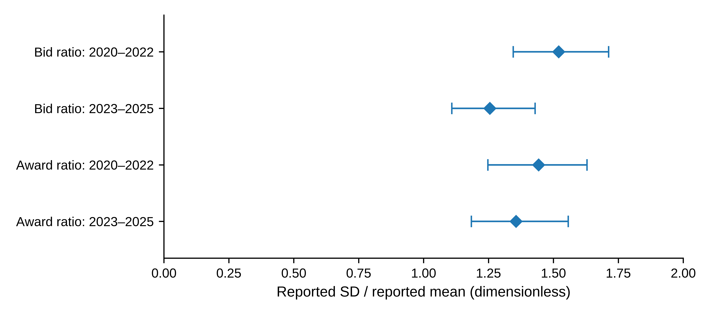
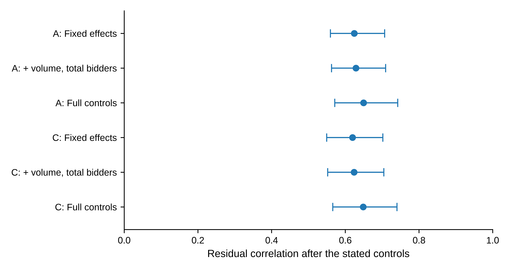
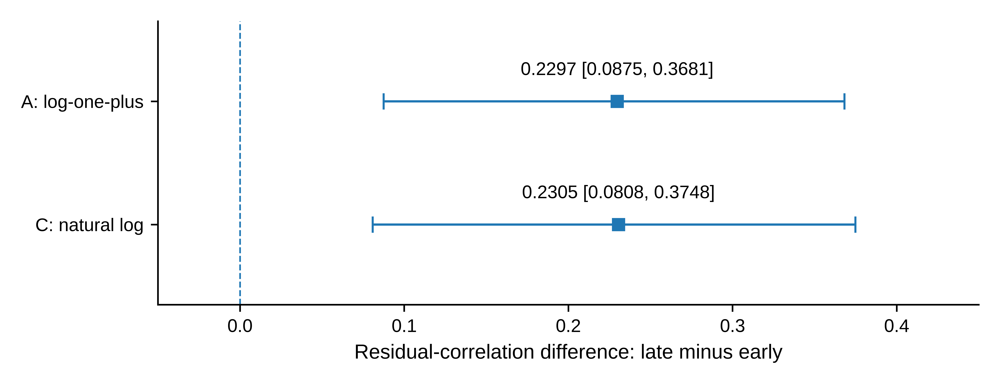

# Bid and award dispersion in European carbon auctions

*Conditional association and temporal heterogeneity, 2020–2025*

**Zhongfei Tian · Xiang Wang**

Zhengzhou University of Aeronautics, Zhengzhou, Henan, China

**Corresponding author:** Zhongfei Tian · 15517837680@163.com

## Abstract

Public carbon-auction reports summarize both market participation and the dispersion of quantities bid and won. We examine how the two reported dispersion measures co-vary after accounting for auction scale and participation, and whether their association differs across time. The sample comprises 1,281 successful European Union Allowance auctions reported by the European Energy Exchange during 2020–2025. Each indicator divides a reported standard deviation by its reported mean; matched bidder populations are not assumed. With auction volume, bidder counts, the cover ratio, reporting-series effects and year–month effects as controls, residual correlations are 0.650 under a log-one-plus transformation and 0.649 under natural logarithms. Exploratory three-month block intervals are [0.571, 0.742] and [0.566, 0.740]. The positive direction remains in reduced-control and influence diagnostics. Correlations are about 0.55 in 2020–2022 and 0.78 in 2023–2025, with secondary exploratory correlation differences of about 0.23. The later period nevertheless has lower marginal medians of both indicators. The results distinguish the level of reported dispersion from the strength and temporal scope of its conditional association. They provide an auction-level characterization of published quantity statistics, not an identified allocation effect or a comparison of inequality within a matched bidder population.

**Keywords:** European Union Allowances; primary auctions; quantity dispersion; participation; measurement; temporal heterogeneity

**JEL classification:** D44; C13; Q58

## 1 Introduction

How unevenly quantities are bid and awarded is distinct from how much is bid in total. The European Commission publishes quantity moments alongside auction volume and participant counts, while the European Securities and Markets Authority (ESMA) monitors participation and concentration (European Commission 2024; ESMA 2025). These reporting dimensions need not move together. An auction can have similar total bids and participant counts to another auction while the distribution of reported quantities differs. Understanding their joint variation requires an explicit comparison of indicator levels, conditional association and historical scope.

Awards originate in submitted bids, making a positive link plausible but leaving its magnitude undetermined by totals and counts alone. Allocation and selection may produce a relationship even without an identifiable causal channel. Moreover, bid-side and award-side statistics can refer to different groups of participants. We therefore ask two descriptive questions: how closely do the reported dispersion measures co-vary after conditioning on scale and participation, and how much does that association differ between two historical periods?

We analyse 1,281 successful European Union Allowance (EUA) auctions in the EU, DE and PL reporting series of the European Energy Exchange (EEX) during 2020–2025. An observation is a completed auction report. The two indicators divide reported quantity standard deviations by their corresponding reported means. Regressions include auction volume, total and successful bidder counts, the cover ratio, and reporting-series and year–month effects. Alternative transformations use exactly the same observations. Reduced-control and deletion diagnostics assess specified sensitivities; the already explored periods 2020–2022 and 2023–2025 are compared using separately estimated nuisance coefficients.

Three features of the archive emerge. First, the full-sample residual correlation is approximately 0.65 under either transformation, and the positive direction remains with fewer controls and under the completed influence checks. Second, the correlations are approximately 0.55 in the early period and 0.78 in the late period, with direct correlation differences of approximately 0.23. These are secondary exploratory comparisons alongside the protocol's primary slope contrasts. Third, the later sample has lower marginal medians of both reported ratios. A stronger conditional association therefore coexists with lower indicator levels; neither fact subsumes the other.

The contribution is a conditional and period-specific characterization of routinely published quantity statistics. It complements price-focused auction analysis, including Bosco (2023), and the separate descriptive summaries in official monitoring. The increment is the quantified joint relationship and its temporal qualification, not the first use of quantity fields or a new estimator. Denominator identities clarify how normalization enters the comparison, while the empirical results distinguish that arithmetic from estimated co-variation. The study does not presume an error in previous official reporting and does not validate a substitute monitoring indicator.

The analysis is retrospective and exploratory: the historical archive and earlier findings were inspected before supplementary checks were specified. Section 2 introduces the institutional and measurement context; Section 3 defines the data and estimands; Section 4 reports the evidence. Sections 5 and 6 discuss interpretation and conclusions. Online Resource 1 contains the field dictionary, additional results and reproduction details.

## 2 Auction context and related research

### 2.1 Allocation, participation and quantities

EEX describes its emissions auctions as single-round, sealed-bid, uniform-price auctions. Bids are ranked by price, successful orders pay the clearing price, and marginal execution can be partial. Participants may bid on their own account or on behalf of clients (EEX n.d.). A reporting participant therefore need not be the final installation using allowances for compliance. This distinction matters for the quantities and counts studied here, which cannot be converted into client-level demand without additional information.

Auctioning allowances can affect the distribution of rents and the allocation of permits, rather than only the observed clearing price (Cramton and Kerr 2002). Multi-unit auction theory also links bidding incentives and demand reduction to allocation outcomes (Ausubel et al. 2014). These considerations explain why quantity distributions are economically relevant. They do not turn our report-level regression into a test of strategic bidding: private valuations and participant-specific bid schedules are absent.

The empirical distinction is between auction-level quantities, their distributional summaries and the allocation mechanism. Our data observe the first two through public fields. They do not recover the private valuations or bid schedules required to identify the third.

### 2.2 Direct comparisons and measurement interpretation

Bosco (2023) provides a direct primary-market comparison, studying Phase III EUA auction prices and return volatility using a bidding model and GARCH specifications. Participation and the cover ratio enter that analysis; its bid spread is a price variable, not a quantity standard deviation. Niu and Liu (2024) instead forecast EUA futures volatility with macroeconomic information. Neither price variation over time nor a forecast issued before trading is the outcome examined here: our quantities and conditioning variables come from the same completed auction report.

Official reporting is an equally important comparator. The Commission distinguishes individual-auction means from monthly aggregates and describes the bid and award means using participating and successful bidders, respectively (European Commission 2024). ESMA (2025) distinguishes participation indicators from concentration statistics and identifies different data sources. Quantity dispersion is therefore an established reporting dimension. Our empirical increment is a conditional comparison of the two reported measures and its temporal scope, not the construction of another conventional ratio or a claim of first use of these fields.

Two measurement cautions shape the design. Shared ratio components can affect regression relationships, so normalizing by a mean is not a substitute for making totals and counts explicit (Kronmal 1993). In addition, association between observed indicators does not identify a latent common factor. The multiple-proxy framework of Meijer et al. (2025) makes the identification and normalization conditions for that different task explicit. We impose no such factor model. The analysis retains the original report fields, examines the specified transformations and control sets, and uses a separate algebraic check to explain the role of constructed denominators.

## 3 Data and empirical design

### 3.1 Reporting archive and sample definition

The data are six EEX annual primary-auction workbooks for 2020–2025, preserved in a fixed research snapshot. Extracting every dated row yields 1,327 records. The sample retains product code T3PA, the EU/DE/PL reporting series and an explicit successful status. The rule excludes 38 other-product records, five records outside the specified series and three cancelled auctions. It leaves 1,281 unique auctions between 7 January 2020 and 15 December 2025, covering all 72 calendar months. Table 1 gives their distribution. The three series belong to the same allowance market and are not independent-market replications.

**Table 1 Sample composition by year and reporting series**

| Year | EU | DE | PL | Total |
|---|---:|---:|---:|---:|
| 2020 | 139 | 46 | 24 | 209 |
| 2021 | 132 | 45 | 46 | 223 |
| 2022 | 142 | 46 | 23 | 211 |
| 2023 | 143 | 47 | 24 | 214 |
| 2024 | 142 | 46 | 24 | 212 |
| 2025 | 142 | 45 | 25 | 212 |
| Total | 840 | 275 | 166 | 1281 |

*Note:* Counts refer to successful T3PA auctions satisfying the stated series restriction. Cancelled auctions and other products are not recoded as zero outcomes. The first three years contain 643 auctions and the final three contain 638.

The selected sample has complete numeric fields for the fixed measures and controls. Both reported means are positive; neither standard-deviation field contains a zero. No auction is removed because its dispersion ratio is large or small. There is one selected auction per distinct date, but observations can remain dependent over time. Selection on successful completion defines the population of interest; the analysis does not describe cancelled auctions or latent demand.

Records retain their source workbook, sheet and row. The completed audit reconciled all 46 exclusions and matched 13 numeric fields across the 1,327 dated records, giving 17,251 comparisons. A separate XML-reading route agreed with the workbook import. These checks establish numerical traceability of the frozen snapshot rather than historical first-release availability. Online Resource 1 documents the source versions and reproduction procedure.

For descriptive context, Table 2 reports the two dispersion ratios (reported standard deviation divided by reported mean), the conditioning variables and total bid volume. All summaries give each auction equal weight. Volumes are displayed in millions of tCO2; ratios and counts retain their original scales. Quartiles use linear interpolation. No winsorization, trimming or additional sample restriction is applied.

**Table 2 Descriptive statistics of the successful-auction sample**

| Variable | Mean | Q1 | Median | Q3 | Min. | Max. |
|---|---:|---:|---:|---:|---:|---:|
| Bid ratio $r^b$ | 1.404 | 1.202 | 1.387 | 1.579 | 0.847 | 2.622 |
| Award ratio $r^w$ | 1.422 | 1.215 | 1.399 | 1.598 | 0.443 | 2.707 |
| Cover ratio $R$ | 1.825 | 1.540 | 1.740 | 2.030 | 1.010 | 3.780 |
| Auction volume $V$ | 2.675 | 2.296 | 2.651 | 3.245 | 0.970 | 6.399 |
| Submitted volume $B$ | 4.717 | 3.986 | 4.736 | 5.321 | 1.937 | 12.899 |
| Total bidders $N$ | 22.663 | 20 | 23 | 25 | 12 | 31 |
| Successful bidders $S$ | 16.878 | 14 | 17 | 20 | 3 | 27 |

*Note:* All rows use 1,281 auctions. $V$ and $B$ are in million tCO2, $N$ and $S$ are bidder counts, and the three ratios are dimensionless. $B$ maps to the source field “Total Amount of Bids” in the workbook's volume section, not to auction revenue. Q1 and Q3 are the 25th and 75th percentiles. These are marginal descriptive statistics, not conditional estimates or bidder-level distributional comparisons.

The separate sample medians are 23 participating bidders, 17 successful bidders, 2.651 million tCO2 of reported auction volume and a cover ratio of 1.740; they need not describe one observed auction. The median reported bid and award ratios are 1.387 and 1.399. Figure 1 places the historical marginal medians and interquartile ranges on a common scale. Online Resource 1, Table S5, retains the complete period-specific descriptions. These distributional summaries are different objects from the conditional correlations estimated below.

{width=6.4in}

**Fig. 1** Marginal reported dispersion ratios by historical period; diamonds denote auction-level medians and horizontal segments extend from the 25th to the 75th percentile. Each early-period row contains 643 auctions and each late-period row 638. These segments describe the middle half of the observations; they are not confidence intervals or paired-bidder comparisons. The figure reuses the descriptive statistics in Online Resource 1, Table S5

### 3.2 Reported measures and linear projection

Let $\mu^b_t,s^b_t$ denote the reported mean and standard deviation of bid volume, and $\mu^w_t,s^w_t$ the corresponding reported moments of volume won. Define

$$
r^b_t=\frac{s^b_t}{\mu^b_t},\qquad r^w_t=\frac{s^w_t}{\mu^w_t}.\qquad (1)
$$

We call these *reported dispersion ratios*. The original labels refer to volume per bidder. Nevertheless, the population underlying each standard deviation and its variance divisor have not been conclusively matched to the paired mean throughout the archive. The ratios are therefore not interpreted as verified coefficients of variation for an identical population before and after allocation. This restriction affects the economic interpretation, not the arithmetic definition in (1).

Specification A sets $x_t=\log(1+r^b_t)$ and $y_t=\log(1+r^w_t)$. The main conditional projection is

$$
y_t=\beta x_t+\boldsymbol{\gamma}^{\prime}\mathbf{z}_t+\alpha_{j(t)}+\delta_{m(t)}+u_t,\qquad (2)
$$

where $j(t)$ denotes the reporting series, $m(t)$ the original year–month, and $\mathbf{z}_t=(\log R_t,\log V_t,\log N_t,\log S_t)^{\prime}$. Here $R$ is the reported cover ratio, $V$ reported auction volume, $N$ total bidders and $S$ successful bidders. The submitted-volume field $B$, used in the denominator audit and Table 2, is labelled “Total Amount of Bids” in the source workbook; it is not an additional regressor in (2). All observations have equal weight. The pooled full design has rank 79 and 1,202 residual degrees of freedom.

The fixed supplementary measurement comparison contains A, a positive-standard-deviation version of A labelled B, and a natural-log version C on the same positive sample. Since all selected standard deviations are positive, A and B are identical. B is retained in the reproduction record as a sample-eligibility check rather than a separate result. C uses $x_t=\log r^b_t$ and $y_t=\log r^w_t$ on exactly the same 1,281 rows. No constant is added to a zero standard deviation.

All variables concern the same completed auction. In particular, the cover ratio and successful-bidder count are simultaneous outcomes, not instruments or inputs known before bidding. Equation (2) is an equal-auction-weighted descriptive linear projection for the selected archive. Its coefficient depends on the conditioning set and on the distribution of those auctions. To examine dependence on those conditions, we also report fixed effects alone and fixed effects plus $\log V$ and $\log N$. These models answer related, but not identical, conditional questions. Year–month effects account for monthly levels; they do not absorb every daily common shock.

Reported means are numerically consistent with total submitted volume divided by $N$ and reported auction volume divided by $S$, to the archive's displayed precision. This creates an explicit denominator structure. Under natural logs, constructed means and a constructed cover ratio yield additive identities that disappear after projection on the corresponding totals and counts. The log-one-plus transformation does not have that property. Online Resource 1 derives and checks these identities, keeping constructed fields separate from the reported fields used in (2).

### 3.3 Magnitude, dependence and sensitivity

Let $\mathbf Z$ contain the nuisance regressors and fixed effects in (2), and let $M_Z$ denote the residual-maker for that space. With $\widetilde{\mathbf x}=M_Z\mathbf x$ and $\widetilde{\mathbf y}=M_Z\mathbf y$, the coefficient and standardized association are

$$
\widehat\beta=\frac{\widetilde{\mathbf x}^{\prime}\widetilde{\mathbf y}}{\widetilde{\mathbf x}^{\prime}\widetilde{\mathbf x}},\qquad
\widehat\theta=\widehat\beta\frac{s(\widetilde{\mathbf x})}{s(\widetilde{\mathbf y})}.\qquad (3)
$$

This is the partial-regression representation (Lovell 1963). In the present equal-weight, single-added-regressor setting, $\widehat\theta$ is the sample correlation of the two residuals. The partial coefficient of determination satisfies

$$
R^2_{\mathrm{partial}}=\frac{\operatorname{SSE}_Z-\operatorname{SSE}_{Z,x}}{\operatorname{SSE}_Z}=\widehat\theta^{\,2}.\qquad (4)
$$

These are complementary scales for the same association, not independent pieces of evidence. The residual correlation is symmetric in the two indicators; placing award dispersion on the left of the regression does not establish a direction of transmission. Pooled and subperiod correlations use their respective fitted control spaces and variances, so a change in correlation need not be a change in a structural parameter. We also report the fitted transformed-response contrast corresponding to an observed interquartile range of residualized $x$. It is a scale illustration along the fitted partial regression, not an intervention or an expected procurement gain.

The principal uncertainty calculation uses a month-block resampling design for dependent observations, within the general class discussed by Lahiri (2003). It resamples non-circular blocks of three consecutive calendar months. Starting months are drawn with replacement; blocks are concatenated and truncated to a 72-month axis. All auctions in a selected month are retained jointly. Repeated months increase row multiplicities and retain their original fixed-effect labels. The entire conditional projection is re-estimated for each of 999 draws. A and C share the draw indices. One- and six-month blocks, with 199 draws each, provide bounded sensitivity checks. Intervals are percentile intervals with linear quantile interpolation.

We examine influence by deleting each observation, month, year and series, and by jointly omitting the 13 largest-Cook-distance observations under each specification (Cook 1977). These diagnostics do not redefine the main sample. Within-series models retain their own monthly effects; empty months retain their positions on the 72-month resampling axis. Reduced-control and within-series intervals use 499 and 399 three-month block draws, respectively.

### 3.4 Historical comparison and research process

The historical comparison divides 2020–2022 from 2023–2025, a split already present in earlier exploration. The two samples contain 643 and 638 observations, and all nuisance coefficients are estimated separately. Each 36-month half is independently resampled in three-month blocks for 999 paired draws, with common indices across transformations. The protocol's primary contrasts are late-minus-early slopes, $\Delta\beta=\beta_{\mathrm{late}}-\beta_{\mathrm{early}}$. Each transformation receives a 97.5% percentile interval as a Bonferroni-style nominal family-95% sensitivity calculation, conditional on adequate individual interval approximations. We also display the previously computed secondary contrasts $\Delta\theta=\theta_{\mathrm{late}}-\theta_{\mathrm{early}}$ with their exploratory 95% intervals. These are direct comparisons of standardized association; a slope-difference interval does not test a correlation difference. The secondary intervals are neither family-adjusted over the two transformations nor replacements for the originally designated primary contrasts.

The full archive and earlier results were inspected before the supplementary protocols were recorded. The evidence for the first protocol freeze is partial. This study is consequently retrospective and exploratory, with no untouched holdout or preregistration claim. The block intervals do not adjust for the full history of specification selection. They also do not guarantee coverage under arbitrary temporal change: pooled slope heterogeneity complicates a stationarity interpretation, while independent half-period resampling does not represent all cross-boundary dependence. These qualifications apply to all inferential results below.

Generative AI tools, including ChatGPT, assisted research organization, code-related work, and manuscript drafting and revision. Their role included generative drafting rather than spelling and grammar correction alone. This author-information and editorial revision uses the frozen regression outputs and previously tabulated descriptions. It performs no new estimation, resampling, hypothesis test or descriptive calculation. The accompanying protocols, source checks and code specify the analysis independently of the drafting tools.

## 4 Results

### 4.1 Magnitude of the pooled relationship

Table 3 reports the two distinct transformations. Under A, the slope is 0.8802 and the residual correlation is 0.6496, with a three-month block interval of [0.5714, 0.7422]. Under C, the corresponding values are 0.8797 and 0.6486, with correlation interval [0.5660, 0.7402]. Thus, the relationship is of similar standardized magnitude under the two transformations on the identical sample. The transformation comparison is not affected by zero-standard-deviation exclusions, because the sample contains none.

**Table 3 Pooled conditional association**

| Transformation | $\widehat\beta$ | 95% interval for $\beta$ | $\widehat\theta$ | 95% interval for $\theta$ |
|---|---:|---|---:|---|
| A: log-one-plus | 0.8802 | [0.7506, 1.0384] | 0.6496 | [0.5714, 0.7422] |
| C: natural log | 0.8797 | [0.7627, 1.0143] | 0.6486 | [0.5660, 0.7402] |

*Note:* Each row uses 1,281 successful auctions, the full controls and reporting-series and year–month effects. Intervals use 999 three-month block draws. The planned positive-sample log-one-plus specification B equals A and is not duplicated. The intervals are exploratory, as described in Section 3.4.

The partial $R^2$ is approximately 0.422 under A and 0.421 under C. These values describe the in-sample reduction in residual squared error relative to the fitted control-only model, not validation of one indicator as a substitute for the other. They do not describe a proportion of total market variation explained or an out-of-sample improvement. To illustrate the association on its transformed scale, the frozen estimates imply fitted contrasts of 0.0816 under A and 0.1408 under C across their respective observed interquartile ranges of residualized bid dispersion. Different transformations have different units, so equality of those contrasts is neither expected nor required.

The pooled correlation intervals remain positive in the one- and six-month block checks (Online Resource 1, Table S2). Both principal slope intervals in Table 3 include one. A slope across reports is not a within-auction comparison of an identical bidder population, however, so its value relative to one does not test dispersion compression.

### 4.2 Controls, influence and reporting series

Figure 2 examines whether the positive direction appears only after conditioning on the cover ratio and successful-bidder count. With series and year–month effects alone, residual correlations are 0.6243 under A and 0.6197 under C. Adding volume and total participation yields 0.6289 and 0.6239. The full controls give slightly larger values. Thus, the direction is already present in models that omit the two additional simultaneous outcomes. This does not establish their exogeneity or eliminate selection associated with successful auctions.

{width=6.4in}

**Fig. 2** Residual correlations across conditioning sets; A and C denote log-one-plus and natural-log ratios, respectively. Bars are exploratory 95% three-month block intervals, using 499 draws for the reduced controls and 999 for full controls. FE denotes reporting-series and year–month effects; full controls also include the cover ratio and successful-bidder count. Exact values are retained in Online Resource 1, Table S6. These rows are related descriptive projections, not independent replications

Deletion diagnostics lead to the same directional conclusion. Removing one month at a time gives residual correlations of 0.6419–0.6656 under A and 0.6405–0.6674 under C. Year and series deletions produce wider positive ranges. Individual-observation deletion also preserves the direction. Omitting the 13 largest-Cook-distance observations raises the correlations to 0.6911 and 0.6930; these values are diagnostic only, and all principal estimates retain the full sample. Online Resource 1, Table S3, reports the complete ranges. A statistically influential auction is not thereby an erroneous observation.

Within-series estimates are positive in EU, DE and PL under both transformations (Online Resource 1, Table S4). Their differences are not formal between-series contrasts or independent-market replications. In particular, PL has 166 observations and only 90 residual degrees of freedom after its controls and month effects. The pooled direction remains positive in these specific control and deletion exercises. These diagnostics do not rule out common determinants of the two report fields.

### 4.3 Directional persistence and temporal heterogeneity

Table 4 separates three estimands: period-specific association (Panel A), the primary slope contrast (Panel B), and the secondary direct correlation contrast (Panel C). Under A, residual correlation is 0.5501 in 2020–2022 and 0.7798 in 2023–2025; under C, it is 0.5414 and 0.7719. Both halves retain positive association. Figure 3 displays the direct differences in correlation, rather than asking readers to infer them from slope intervals or separate period intervals.

**Table 4 Historical period comparison**

*Panel A: Period-specific estimates*

| Spec. | Period | $n$ | $\widehat\beta$ | $\widehat\theta$ [95% interval] |
|---|---|---:|---:|---|
| A | 2020–2022 | 643 | 0.6728 | 0.5501 [0.4570, 0.6486] |
| A | 2023–2025 | 638 | 1.1825 | 0.7798 [0.6757, 0.8892] |
| C | 2020–2022 | 643 | 0.6880 | 0.5414 [0.4394, 0.6493] |
| C | 2023–2025 | 638 | 1.1232 | 0.7719 [0.6645, 0.8829] |

*Panel B: Late-minus-early slope differences*

| Transformation | $\Delta\widehat\beta$ | 97.5% interval |
|---|---:|---|
| A | 0.5097 | [0.3340, 0.7222] |
| C | 0.4353 | [0.2605, 0.6344] |

*Panel C: Late-minus-early residual-correlation differences (secondary exploratory contrasts)*

| Transformation | $\Delta\widehat\theta$ | Exploratory 95% interval |
|---|---:|---|
| A | 0.2297 | [0.0875, 0.3681] |
| C | 0.2305 | [0.0808, 0.3748] |

*Note:* All nuisance coefficients are estimated separately in the two halves. The frozen 999 paired draws resample three-month blocks independently within each 36-month half, using common indices across transformations. Panel A gives 95% intervals for each period's correlation. Panel B retains the primary slope contrasts and their 97.5% intervals. Panel C displays the already computed secondary correlation contrasts with 95% intervals, without multiplicity adjustment across transformations. This presentation does not promote Panel C to a prospectively primary analysis. Historical selection and cross-boundary dependence limitations apply to all panels.

The direct correlation differences are 0.2297 under A and 0.2305 under C, with secondary 95% intervals of [0.0875, 0.3681] and [0.0808, 0.3748]. The primary slope differences are 0.5097 and 0.4353, with the distinct 97.5% intervals shown in Panel B. Thus, both scales describe a stronger fitted relationship in the later sample under the stated exploratory scheme. The evidence for the correlation contrast is its own interval, not significance of $\Delta\beta$ or non-overlap of period-specific bars.

{width=6.4in}

**Fig. 3** Late-minus-early differences in residual correlation, comparing 2023–2025 with 2020–2022; squares mark the two transformations identified by their row labels. Bars reproduce the frozen secondary exploratory 95% intervals, without adjustment across transformations. The vertical line marks zero difference. Primary slope contrasts and their 97.5% intervals are reported separately in Table 4, Panel B

Indicator levels move differently from the strength of association. The marginal median bid ratio is 1.520 in 2020–2022 and 1.255 in 2023–2025; the corresponding award medians are 1.443 and 1.356 (Online Resource 1, Table S5). Higher conditional co-movement therefore coexists with lower marginal report ratios in this sample. These summaries compare auctions in two periods, not matched bidders, and they are not a test of a population-wide decline in dispersion. Nor do they establish what explains the correlation difference. Separately estimated control spaces, residual scales, participant composition and reporting conventions may all matter. January 2023 remains a historical comparison boundary, not an identified policy intervention.

## 5 Discussion

### 5.1 Indicator levels and conditional co-variation

The principal result concerns joint variation rather than the unsurprising origin of awards in bids. The conditional correlation is about 0.65 and remains positive under the specified transformation, control and influence checks. The direct correlation contrast is about 0.23 across the two historical halves. This temporal comparison is particularly informative alongside the lower late-period marginal medians: indicator levels and co-movement describe different aspects of the same reporting archive.

The estimates complement official summaries of quantity moments, participation and auction size. They quantify a relationship across completed auction reports after a stated set of linear controls. That relationship is not fully summarized by the level of either ratio or by a single pooled coefficient. The pooled projection remains a valid full-sample description, while the period-specific estimates make its historical heterogeneity explicit. Neither the higher correlation nor the lower marginal medians ranks the two periods by allocation quality.

The denominator analysis serves a narrower purpose. It isolates identities induced by constructed totals and counts, without proving that all mechanical or economic links have been removed. The ordinary-log comparison shows that the direction is not specific to log-one-plus ratios. It does not identify a new measurement instrument or establish that one indicator can replace the other. The study's contribution is this reproducible, measurement-explicit empirical characterization; it does not document prior misuse of the indicators or test a benefit from applying the relationship in a monitoring decision.

### 5.2 What remains unidentified

The economic interpretation is constrained by three features of the evidence. First, standard-deviation populations and variance divisors are not fully documented across the archive. The numerical report ratios are well defined, but they cannot be treated as authenticated changes in dispersion within a common bidder population. Report participants may also represent clients. Similar labels across annual files are not proof of unchanging populations.

Second, the study conditions on auction success and uses contemporaneous outcomes. The reduced-control comparison shows that the positive direction is present without conditioning on successful bidders and the cover ratio. It does not resolve endogenous selection, shared demand conditions or the allocation link between the two variables. The stronger late-period association cannot be assigned to reporting changes, bidding composition or a particular policy from this design. In particular, lower marginal report ratios do not identify improved equality, competition or allocation efficiency.

Third, the comparison is historical and exploratory. Month blocks provide a specified dependence approximation; pooling heterogeneous periods and resampling the halves independently add limitations. The nominal 95% correlation intervals and 97.5% primary slope intervals do not adjust for the full history of question and specification selection. The displayed secondary contrasts retain their original status. Numerical replication and sensitivity checks do not convert them into confirmatory tests.

These boundaries leave an interpretable empirical object: association among published quantities within successful auctions. Historical population metadata or an independently defined economic outcome would be required to evaluate a more ambitious measurement or behavioural claim. Their absence is a limitation of the present contribution, not a reason to invent that claim from the fitted correlation.

## 6 Conclusion

Across 1,281 successful EUA auctions during 2020–2025, reported bid and award dispersion have a positive conditional association, with residual correlations near 0.65 under two transformations. The direction remains in the completed control, block-length and influence checks. The late-minus-early correlation difference is approximately 0.23 under the secondary exploratory comparison, while marginal medians of both reported ratios are lower in the later period.

The findings show why indicator levels, conditional co-variation and temporal scope should be reported separately. A pooled relationship describes the selected archive but does not establish an invariant allocation mapping. The evidence concerns reported auction-level statistics; causal allocation effects, matched-bidder inequality and operational decision value remain outside the design.

## Data and computer code availability

The EEX input snapshot is identified by commit `5745eb3ddca79602346053446583d794b0e09800` in the public repository `124-creator/-123`. The principal analysis and robustness extension are fixed at commits `e25c1e02e1a58e0aec1084f7419066855e9565ec` and `d4b26f1bbd8c1d7c036259e48e119c9c12f6c9a9`. Online Resource 1 specifies the source paths and reproduction requirements. The workbooks originate from EEX and remain subject to its rights and applicable terms; repository availability does not grant a separate redistribution licence. The final journal-facing data-deposit or access arrangement requires author confirmation. This revision does not change the input, computed descriptions, regression estimates or bootstrap outputs.

## Statements and Declarations

**Funding:** The authors received no financial support for this research.

**Competing interests:** [Both authors must confirm their relevant financial and non-financial interests before submission.]

**Author contributions:** [Zhongfei Tian and Xiang Wang must confirm their actual contributions in the separate title-page record; author order is not a substitute for a contribution statement.]

**Author-review status:** Xiang Wang has reviewed the manuscript. Remaining author declarations and the final data-access arrangement are recorded separately.

## Supplementary information

**Online Resource 1** Field dictionary, sample provenance, resampling implementation, additional sensitivity tables and measurement identities

## References

Ausubel LM, Cramton P, Pycia M, Rostek M, Weretka M (2014) Demand reduction and inefficiency in multi-unit auctions. The Review of Economic Studies 81:1366–1400. https://doi.org/10.1093/restud/rdu023

Bosco B (2023) Trade, equilibrium prices and rents in European auctions for emission allowances. Environmental Economics and Policy Studies 25:87–113. https://doi.org/10.1007/s10018-022-00344-y

Cook RD (1977) Detection of influential observation in linear regression. Technometrics 19:15–18. https://doi.org/10.1080/00401706.1977.10489493

Cramton P, Kerr S (2002) Tradeable carbon permit auctions: how and why to auction not grandfather. Energy Policy 30:333–345. https://doi.org/10.1016/S0301-4215(01)00100-8

EEX (n.d.) Frequently Asked Questions: Emissions Auctions. European Energy Exchange. https://www.eex.com/en/faq. Accessed 10 October 2026

European Commission (2024) Auctions by the Common Auction Platform: April, May, June 2024. https://climate.ec.europa.eu/document/download/d962459c-021e-4901-b49f-e5d37e5d2c93_en?filename=cap_report_202406_en.pdf. Access record: 10 October 2026

European Securities and Markets Authority (ESMA) (2025) Market Report on EU carbon markets. ESMA50-481369926-30552. https://www.esma.europa.eu/sites/default/files/2025-10/ESMA50-481369926-30552_Carbon_Markets_Report_2025.pdf. Accessed 10 October 2026

Kronmal RA (1993) Spurious correlation and the fallacy of the ratio standard revisited. Journal of the Royal Statistical Society: Series A 156:379–392. https://doi.org/10.2307/2983064

Lahiri SN (2003) Resampling methods for dependent data. Springer, New York. https://doi.org/10.1007/978-1-4757-3803-2

Lovell MC (1963) Seasonal adjustment of economic time series and multiple regression analysis. Journal of the American Statistical Association 58:993–1010. https://doi.org/10.1080/01621459.1963.10480682

Meijer E, Postepska A, Wansbeek T (2025) Handling multiple proxies. Empirical Economics 69:2901–2926. https://doi.org/10.1007/s00181-025-02825-x

Niu H, Liu T (2024) Forecasting the volatility of European Union allowance futures with macroeconomic variables using the GJR-GARCH-MIDAS model. Empirical Economics 67:75–96. https://doi.org/10.1007/s00181-023-02551-2
