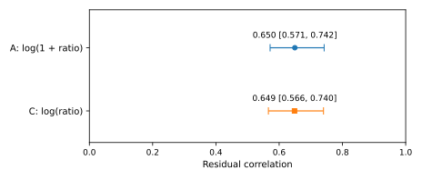
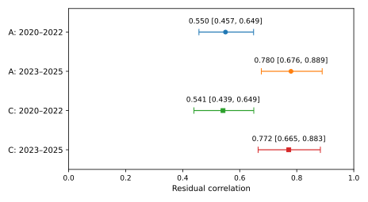

## Abstract

Carbon-auction reports describe the scale of bids, participation and the dispersion of quantities bid and won. Whether the two dispersion measures convey a similar picture after accounting for scale and participation is an empirical question. We examine 1,281 successful European Union Allowance auctions reported by the European Energy Exchange during 2020–2025. The measures are ratios of reported standard deviations to reported means, without assuming that they describe matched bidder populations. Conditioning on auction volume, participation, the cover ratio, auction series and year–month effects yields a residual correlation of 0.650 under a log-one-plus transformation and 0.649 under natural logarithms. Three-month block intervals are [0.571, 0.742] and [0.566, 0.740]. Positive association also remains under reduced control sets and observation, month, year and series deletion diagnostics. The relationship is nevertheless temporally heterogeneous: residual correlations are approximately 0.55 in 2020–2022 and 0.78 in 2023–2025. We distinguish this empirical co-movement from denominator identities and retain the limits of the historical, exploratory design. The evidence characterizes the joint behaviour of public quantity statistics, while showing why their pooled relationship should not be treated as a time-invariant allocation rule or a comparison of bidder inequality before and after an auction.

**Keywords:** European Union Allowances; primary auctions; quantity dispersion; auction reporting; temporal heterogeneity

**JEL classification:** D44; Q58; C21

## 1. Introduction

How much is bid in a carbon auction and how unevenly quantities are distributed are different questions. The cover ratio summarizes aggregate bids relative to the quantity auctioned; bidder counts describe participation. Neither statistic uniquely determines dispersion among quantities bid or won. The European Commission publishes quantity means and dispersion alongside participation, while the European Securities and Markets Authority examines participation and concentration in its carbon-market monitoring (European Commission 2024; ESMA 2025). These reports motivate an auction-level question: how closely do the two reported dispersion measures move together once differences in scale, participation and calendar conditions are taken into account?

This question concerns the interpretation of public information about participation and quantity distributions. A market can have similar total bids and participant counts across auctions while the distribution of reported quantities differs. Conversely, two quantity indicators can be strongly associated without measuring the same group of bidders or the same economic concept. Understanding their joint behaviour helps distinguish the information carried by aggregate submitted volume, participation and quantity dispersion. It does not require treating every association as evidence of market power or auction efficiency.

A positive link between bid and award dispersion is plausible because awards originate in submitted bids. Its magnitude, however, does not follow from quantity accounting alone. Allocation depends on the ranking and success of bids; aggregate totals and counts do not uniquely determine either standard deviation. Nor does this expected connection imply a stable relationship across auctions conducted years apart. The relevant empirical tasks are therefore to quantify the conditional relationship, establish how it depends on measurement choices and examine its temporal scope, rather than merely to reject zero correlation.

We use six annual workbooks from the European Energy Exchange (EEX), retaining 1,281 successful European Union Allowance (EUA) auctions in the EU, DE and PL reporting series during 2020–2025. Each observation is an auction report, not a bidder. Our variables are the reported standard-deviation-to-mean ratios for quantities bid and won. The published archive permits a reproducible analysis of these fields, but does not fully establish the population and variance divisor underlying every standard deviation. Accordingly, the estimand remains a relationship between reported indicators. It is not a comparison of a matched bidder population before and after allocation.

The empirical design separates three issues. First, we estimate the within-sample association after controlling for reported auction volume, total and successful bidders, the cover ratio, and series and year–month effects. Second, we examine whether its direction depends on a log-one-plus transformation, simultaneous outcome controls or a small part of the sample. Third, we compare the already explored historical periods 2020–2022 and 2023–2025, allowing all nuisance coefficients to differ. The regressors and response describe the same completed auction, so this is an ex-post conditional analysis rather than a forecasting exercise.

The full-sample residual correlation is about 0.65 under both transformations. The direction remains positive under the specified control and influence checks. Temporal aggregation conceals an important qualification: the residual correlation is about 0.55 in the earlier period and 0.78 in the later period. The period-specific slopes differ under the stated block-resampling approximation. This is evidence against summarizing the archive with a constant descriptive coefficient, not identification of a policy-induced break.

Our contribution is an empirical account of the joint variation and temporal scope of two routinely reported quantity indicators. It complements price-focused auction analysis, such as Bosco (2023), and official reporting of participation and concentration. The measurement analysis clarifies which parts of the relationship are accounting identities and which are estimated from auction-level variation. It does not introduce a new estimator or recover a latent measure of inequality. Its value rests on the quantified relationship and its temporal qualification, rather than on the availability of the data or the sign of a coefficient alone.

The study is exploratory. The historical data and earlier results were inspected before supplementary checks were fixed; the reported intervals do not adjust for the full selection history. Section 2 explains the institutional and measurement setting, Section 3 sets out the design, Section 4 presents the findings, and Sections 5 and 6 discuss their interpretation and conclusions.

## 2. Institutional setting and measurement

### 2.1. What primary-auction reports reveal

EEX describes its emissions auctions as single-round, sealed-bid, uniform-price auctions. Bids are ranked by price, successful bids pay a common clearing price, and marginal execution can be partial. Eligible participants may bid on their own account or for clients (EEX n.d.). This distinction is important: an auction participant is not necessarily the final installation that needs allowances for compliance. Our analysis uses the reporting participant counts and does not reconstruct clients or bidder-specific demand schedules.

The economic literature links auction design to allocation and the distribution of rents. Cramton and Kerr (2002) discuss auctioning rather than grandfathering carbon permits; Ausubel et al. (2014) analyze demand reduction and inefficiency in multi-unit auctions. These studies explain why quantity distributions can matter economically, but they do not turn aggregate dispersion regressions into tests of strategic bidding. Such tests would require identifying assumptions and information about valuations or bidding schedules that are absent here.

The closest price-focused comparison is Bosco (2023), whose analysis connects EUA auction prices and return volatility to bidding, participation and the cover ratio. The present outcome is a quantity-dispersion indicator, not a price, return or bid-price range. The distinction defines our empirical question; it is not a claim that quantity information has been ignored throughout the literature. Indeed, the Commission already reports means and dispersion, and ESMA separately examines concentration using more detailed information (European Commission 2024; ESMA 2025).

The measurement question also differs from treating several observable indicators as proxies for a single unobservable variable. Meijer et al. (2025) develop a multiple-proxy framework with explicit normalization and identification conditions. We do not assume that the two report ratios identify a common latent market-structure factor. Instead, we estimate their joint variation as observed indicators and leave the underlying behavioural interpretation open.

### 2.2. Reported ratios and denominator identities

Let $\mu_{b,t}$ and $s_{b,t}$ denote the reported mean and standard deviation of bid volume in auction $t$, and $\mu_{w,t}$ and $s_{w,t}$ the corresponding reported values for volume won. Define

$$
r_{b,t}=\frac{s_{b,t}}{\mu_{b,t}},\qquad r_{w,t}=\frac{s_{w,t}}{\mu_{w,t}}. \qquad (1)
$$

We call these reported dispersion ratios. The four labels in Table 1 establish the fields being studied; they do not by themselves settle whether each standard deviation uses exactly the population of its paired mean. The Commission's notes distinguish the mean bid quantity per participating bidder from the mean quantity won per successful bidder (European Commission 2024). A difference between the two ratios is therefore not automatically a change in dispersion within the same population.

**Table 1. Reported fields and their role in the analysis**

| Symbol | Original report label | Role |
| --- | --- | --- |
| $\mu_b$ | Average volume bid per bidder | Reported bid mean |
| $s_b$ | Standard deviation of bid volume per bidder | Reported bid standard deviation |
| $\mu_w$ | Average volume won per bidder | Reported award mean |
| $s_w$ | Standard deviation of volume won per bidder | Reported award standard deviation |
| $V$ | Auction Volume | Reported auction quantity |
| $B$ | Total volume of bids submitted | Reported aggregate bids |
| $K$ | Cover Ratio | Reported bid-to-volume ratio |
| $N$ | Total number of bidders | Participating bidders |
| $S$ | Number of successful bidders | Successful bidders |

*Note:* Quantity fields are reported in tCO2. Counts refer to participants, not orders or final clients. The source audit retains workbook, sheet, row and cell-format information. The standard-deviation population and divisor remain unresolved for the complete historical archive.

Ratio regressions require care because components shared through denominators can affect the observed relationship (Kronmal 1993). We retain the volume and participation fields as explicit conditions and check a corresponding algebraic representation. Write $B$ for reported bid volume, $V$ for reported auction volume, $N$ for total bidders and $S$ for successful bidders. Construct $\mu_b^{\mathrm{imp}}=B/N$, $\mu_w^{\mathrm{imp}}=V/S$ and $K^{\mathrm{imp}}=B/V$. For positive quantities,

$$
\log\left(\frac{s_b}{\mu_b^{\mathrm{imp}}}\right)=\log s_b+\log N-\log K^{\mathrm{imp}}-\log V, \qquad (2)
$$

$$
\log\left(\frac{s_w}{\mu_w^{\mathrm{imp}}}\right)=\log s_w+\log S-\log V. \qquad (3)
$$

Once the right-hand-side volume and count terms belong to a common linear control space, the residualized constructed log ratios equal the corresponding residualized log standard deviations. This identity is useful for checking representation and implementation. It does not authenticate the populations behind the reported moments, independently verify $V$ as an observed settlement total, or remove economic links between bids and awards. The main regressions retain the original reported means and cover ratio, whose rounding can prevent exact numerical equality. Log-one-plus ratios do not admit the same additive simplification.

The empirical checks consequently address a limited proposition: whether the estimated direction persists under the specified transformations and controls. They do not test whether an auction compresses bidder inequality. A regression slope across reports is different from a within-auction comparison of a common bidder population, even if that slope is below one.

## 3. Data and empirical design

### 3.1. Archive and sample

The source archive contains the six EEX annual primary-auction workbooks for 2020–2025. The complete extraction has 1,327 date records. A fixed eligibility rule retains product code T3PA, the EU/DE/PL series and an explicit successful status. It excludes 38 other-product records, five records outside the selected series and three cancelled auctions. This leaves 1,281 unique auctions, with the composition shown in Table 2. Cancelled auctions' empty award fields are not recoded as zero dispersion. The study population is successful auctions meeting these restrictions, not all potential demand for allowances.

**Table 2. Sample composition by year and reporting series**

| Year | EU | DE | PL | Total |
| --- | --- | --- | --- | --- |
| 2020 | 139 | 46 | 24 | 209 |
| 2021 | 132 | 45 | 46 | 223 |
| 2022 | 142 | 46 | 23 | 211 |
| 2023 | 143 | 47 | 24 | 214 |
| 2024 | 142 | 46 | 24 | 212 |
| 2025 | 142 | 45 | 25 | 212 |
| Total | 840 | 275 | 166 | 1281 |

*Note:* The sample contains the stated successful T3PA auctions, not every European allowance auction. EU, DE and PL are reporting series within one allowance market. The exclusion rules do not depend on dispersion values.

The included observations run from 7 January 2020 to 15 December 2025. All 72 calendar months appear in the pooled sample, and each included auction has a distinct date. We nevertheless allow temporal dependence; the number of rows is not an effective independent sample size. All required means, volumes, counts and cover ratios satisfy the numeric eligibility rules. Neither reported standard-deviation field contains zero, and no record is trimmed for a large or small dispersion ratio.

The completed source audit compared 13 numeric fields in each of the 1,327 source rows with the extraction, giving 17,251 matching cell comparisons. A separate XML reading route agreed with the workbook-reading route. Candidate records and all exclusions were traced to their source locations; input hashes remained unchanged. These checks establish the numerical reconstruction of the supplied snapshot. The archive is not a collection of authenticated first-release vintages. Online Resource 1 supplies the source locations, audit boundaries and reproduction instructions.

### 3.2. Conditional projections

The principal specification uses $x_t=\log(1+r_{b,t})$ and $y_t=\log(1+r_{w,t})$:

$$
y_t=\alpha_{g(t)}+\lambda_{m(t)}+\beta x_t+\boldsymbol{\gamma}^{\mathsf T}\mathbf z_t+u_t, \qquad (4)
$$

where $g(t)$ denotes the reporting series, $m(t)$ the original calendar year–month, and

$$
\mathbf z_t=(\log K_t,\log V_t,\log N_t,\log S_t)^{\mathsf T}. \qquad (5)
$$

Here $K_t$ is the reported cover ratio. Each auction receives equal weight. Equation (4) is a descriptive linear projection: the cover ratio and successful-bidder count are contemporaneous outcomes, not instruments or predetermined demand shifters. Calendar-month effects remove common monthly levels but not every daily common shock.

Three specifications were recorded in the supplementary measurement protocol. A uses log-one-plus ratios for all eligible observations; B uses the same transformation on the common positive-standard-deviation sample; C uses natural logarithms on that same sample. Because both standard deviations are positive in every retained auction, A and B coincide. We report the two distinct estimates, A and C, and document B as a sample check rather than a replication. No small constant is inserted to create a logarithm of zero.

The controls, row weights and fixed-effect definitions are unchanged between A and C. Both pooled full designs have rank 79 and 1,202 residual degrees of freedom. The completed calculation uses stable least-squares projections and was checked against an explicit-dummy implementation. Computational agreement is documented in Online Resource 1; it does not choose the economic interpretation of the projection.

### 3.3. Comparable association measures

Let $Z$ contain the controls and fixed effects, and let $M_Z$ denote the corresponding residual-maker. With $\widetilde x=M_Zx$ and $\widetilde y=M_Zy$, the partial-regression representation is

$$
\widehat\beta=\frac{\widetilde x^{\mathsf T}\widetilde y}{\widetilde x^{\mathsf T}\widetilde x},
\qquad
\widehat\theta=\widehat\beta\frac{\operatorname{sd}(\widetilde x)}{\operatorname{sd}(\widetilde y)}. \qquad (6)
$$

Under common residualization and equal row weights, $\widehat\theta$ is the residual correlation (Lovell 1963). It places the association on a standardized scale; raw slopes under different transformations need not be numerically equal. With a single additional regressor,

$$
R^2_{\mathrm{partial}}=\frac{\mathrm{SSE}_{Z}-\mathrm{SSE}_{Z,x}}{\mathrm{SSE}_{Z}}=\widehat\theta^2. \qquad (7)
$$

Residual correlation and partial $R^2$ summarize the same fitted relationship. Neither measures an out-of-sample forecasting gain. We also examine two reduced conditioning sets: series and month effects alone, and those effects with auction volume and total bidders. Comparing them with the original full specification establishes whether the positive direction appears only after conditioning on $K$ and $S$. The three specifications describe different conditional objects; none identifies a causal response.

### 3.4. Temporal dependence and sensitivity design

The main uncertainty summary uses non-circular blocks of three consecutive calendar months, with 999 resamples. All auctions in a selected month move together. Repeated months increase row multiplicities while retaining their original fixed-effect labels, and both the controls and focal coefficient are re-estimated. A and C share draw indices. One- and six-month blocks with 199 resamples each provide limited sensitivity checks. The construction follows the block-resampling approach to dependent data reviewed by Lahiri (2003); it does not imply validity under arbitrary changes in the relationship. Full implementation details appear in Online Resource 1.

We interpret the percentile intervals as exploratory summaries of uncertainty under these dependence approximations. The historical snapshot and earlier results were seen before the supplementary analyses were fixed; the first-freeze record is partial. The nominal levels do not account for the complete history of question and specification selection. Temporal heterogeneity also limits a stationary reading of the pooled intervals.

The period comparison uses the split already present in earlier exploration: 2020–2022 versus 2023–2025, containing 643 and 638 auctions. All nuisance coefficients are estimated separately. Each 36-month half is independently resampled in three-month blocks, producing 999 paired draws shared across A and C. The primary contrast is the late-minus-early slope. We report a 97.5% percentile interval for each of the two transformations as a Bonferroni-style family-95% sensitivity calculation, conditional on the adequacy of the individual approximations. Independent half-period resampling does not fully capture dependence across the boundary, and the split is not treated as an exogenous policy intervention.

Influence checks delete each observation, month, year and series in turn. A further diagnostic jointly omits the 13 observations with the largest Cook distances within each specification (Cook 1977); it never replaces the full-sample result. Reduced-control and series-specific interval checks use 499 and 399 three-month resamples, respectively. Empty subseries months retain their places on the calendar axis. These analyses are fixed sensitivity checks, not searches for a new primary sample.

### 3.5. Research process and AI assistance

Generative AI tools assisted research support, code-related work, and manuscript drafting and revision. The present revision uses the frozen experimental outputs and introduces no statistical refitting. The documented source checks and computational cross-checks form part of the reproducibility record. **Author-review item:** the human authors must finalize the tool/version disclosure and confirm responsibility for the analysis, references and text before submission. The assistance is not classified as copy-editing alone.

## 4. Results

### 4.1. A substantial pooled relationship under both transformations

Table 3 reports the two distinct measurement specifications. The log-one-plus estimate has slope 0.8802 and residual correlation 0.6496, with a three-month block interval of [0.5714, 0.7422] for the latter. Natural logarithms give slope 0.8797 and residual correlation 0.6486, with interval [0.5660, 0.7402]. Figure 1 shows the standardized estimates. Thus, the positive direction is not confined to log-one-plus ratios. Because A and B have identical rows, this comparison is not confounded by deleting zero-standard-deviation observations.

**Table 3. Pooled estimates and three-month block intervals**

| Specification | β | β: 95% interval | θ | θ: 95% interval |
| --- | --- | --- | --- | --- |
| A | 0.8802 | [0.7506, 1.0384] | 0.6496 | [0.5714, 0.7422] |
| C | 0.8797 | [0.7627, 1.0143] | 0.6486 | [0.5660, 0.7402] |

*Note:* A uses log-one-plus reported ratios; C uses natural logarithms. Both use 1,281 auctions and the full controls. B is identical to A and is omitted as a duplicate. Intervals are exploratory 95% percentile summaries from 999 three-month block resamples. Partial $R^2=\theta^2$; it is not independent evidence or a forecasting score.

{width=6.1in}

**Fig. 1** Pooled residual correlations for the two distinct transformations

*Note:* Bars show the frozen 95% three-month block intervals. No new estimates or alternative draw realizations are used in this figure.

The partial $R^2$ values, approximately 0.422 and 0.421, indicate how much of the residual squared error from the fitted control-only model is removed by adding the bid-dispersion variable. They quantify association within this sample. They do not establish that the ratios are optimal indicators, or that using the relationship improves market monitoring or procurement decisions. Both principal slope intervals include one; in any case, a slope across auction reports is not a within-population compression coefficient.

### 4.2. The pooled estimate masks temporal variation

The relationship is positive in both historical halves but stronger in the latter. Under A, the residual correlation increases from 0.5501 to 0.7798; under C, from 0.5414 to 0.7719 (Table 4). Nuisance coefficients are allowed to differ across halves, so the comparison is not generated by forcing identical control slopes. Figure 2 displays the period-specific correlations and their exploratory intervals.

**Table 4. Historical period comparison**

**Panel A. Period-specific estimates**

| Spec. | Period | n | β | θ [95% interval] |
| --- | --- | --- | --- | --- |
| A | 2020–2022 | 643 | 0.6728 | 0.5501 [0.4570, 0.6486] |
| A | 2023–2025 | 638 | 1.1825 | 0.7798 [0.6757, 0.8892] |
| C | 2020–2022 | 643 | 0.6880 | 0.5414 [0.4394, 0.6493] |
| C | 2023–2025 | 638 | 1.1232 | 0.7719 [0.6645, 0.8829] |

**Panel B. Late-minus-early slope differences**

| Specification | Δβ | 97.5% interval |
| --- | --- | --- |
| A | 0.5097 | [0.3340, 0.7222] |
| C | 0.4353 | [0.2605, 0.6344] |

*Note:* Each half contains 36 calendar months. Period-specific $\theta$ intervals are 95%; the two $\Delta\beta$ intervals are 97.5% each. The period boundary was already explored. Independent half-period resampling and the stated nominal levels do not correct historical selection or fully model cross-boundary dependence.

{width=6.1in}

**Fig. 2** Residual correlations in the two historical periods

*Note:* Bars reproduce the frozen 95% period-specific intervals from 999 three-month resamples within each half. The slope-difference intervals in Table 4 use the separately stated 97.5% level.

The late-minus-early slope difference is 0.5097 under A, with interval [0.3340, 0.7222], and 0.4353 under C, with interval [0.2605, 0.6344]. These contrasts support temporal variation under the stated exploratory approximation. They do not identify January 2023 as a structural breakpoint or establish a policy cause. Changes in bidding composition, participation, reporting or common conditions remain possible interpretations.

The distinction between direction and strength matters. A positive full-sample association is a useful summary of co-movement, but the period evidence does not support treating the pooled slope as a stable conversion rule between the two report indicators. The latter claim would be stronger than the evidence, even if the sign were unchanged in every sensitivity check.

### 4.3. Controls and influential observations do not account for the sign

The relationship is present before conditioning on the cover ratio and successful-bidder count. With series and year–month effects alone, residual correlations are 0.6243 under A and 0.6197 under C. Adding reported volume and total bidders yields 0.6289 and 0.6239 (Table 5). The full-control estimates are somewhat larger, but the positive direction does not originate solely from adding the two simultaneous outcomes. This is a sensitivity comparison, not evidence that the controls are exogenous or that selection has been eliminated.

**Table 5. Residual correlations across conditioning sets**

| Conditioning set | A: θ [95% interval] | C: θ [95% interval] |
| --- | --- | --- |
| Series and month effects | 0.6243 [0.5596, 0.7067] | 0.6197 [0.5494, 0.7017] |
| Effects + volume + bidders | 0.6289 [0.5626, 0.7094] | 0.6239 [0.5521, 0.7044] |
| Full controls | 0.6496 [0.5714, 0.7422] | 0.6486 [0.5660, 0.7402] |

*Note:* Reduced-control intervals use 499 three-month block resamples. The full-control intervals reproduce Table 3. Different conditioning sets define different descriptive projections.

The deletion diagnostics preserve the same direction (Online Resource 1, Table S2). Removing one month at a time gives residual correlations of 0.6419–0.6656 for A and 0.6405–0.6674 for C. Year, series and individual-observation deletions produce positive ranges as well. Jointly deleting the 13 highest-Cook-distance observations increases the correlations to 0.6911 and 0.6930; the original full-sample results remain the principal estimates. Statistical influence alone is not a reason to treat an auction record as erroneous.

These are deterministic ranges across specified deletions, not confidence intervals. They restrict explanations based on a single month, year, series or a few observations dominating the pooled association. They do not exhaust common-cause or selection explanations for its existence.

### 4.4. Series, block length and denominator checks

Within-series correlations are positive for EU, DE and PL (Online Resource 1, Table S3). Under A they are 0.6898, 0.5619 and 0.8076. These estimates are not independent-market replications, and different point values do not establish a formal between-series contrast. PL has only 166 auctions and 90 residual degrees of freedom, so its larger point estimate requires particular caution.

One- and six-month block choices retain positive pooled correlation intervals (Online Resource 1, Table S1). For C, they are [0.5855, 0.7134] and [0.5526, 0.7493]; for A, [0.5903, 0.7158] and [0.5564, 0.7438]. This establishes sensitivity to two specific block choices, not to all dependence models. The 199-draw tail quantiles have Monte Carlo uncertainty.

Reported means differ from $B/N$ and $V/S$ by at most 0.5 quantity units, and the largest absolute discrepancy between the reported cover ratio and $B/V$ is approximately 0.004994. Constructed-input residual identities hold to numerical precision. The former findings are consistent with displayed precision; the latter check equations (2)–(3) and the projection code. Neither result changes the main reported fields or constitutes an additional discovery about the allocation mechanism.

## 5. Interpretation and limitations

### 5.1. What quantity reporting adds to the empirical picture

The central finding is a connection of appreciable magnitude that is robust in direction but not constant in strength. The observed correlation of about 0.65 persists after accounting for reported totals, participation and monthly conditions. Thus, those controls do not exhaust the joint linear variation of the two report indicators. Their shared quantity basis provides a plausible connection, but does not supply the estimated magnitude or the observed period difference by itself.

This result complements rather than replaces monitoring of aggregate submitted volume and participation. It provides a quantitative description of how two published summaries behave together within the selected successful-auction archive. It does not show that one can substitute for the other, reconstruct an unobserved bidder distribution, or improve an operational monitoring decision. That distinction is important when the available variables are summaries with incompletely documented populations, rather than alternative measurements of an identified latent concept.

The temporal result provides the clearest qualification to a pooled interpretation. The association is closer in 2023–2025 than in 2020–2022 under both transformations. Applying the pooled relationship indiscriminately would overlook that difference. A stronger association is not inherently evidence of a better or worse auction outcome: the data do not reveal whether changes in participant composition, reporting conventions or bidding behaviour are responsible. The appropriate contribution is therefore to document the temporal scope of the relationship, not to assign a welfare meaning to it.

### 5.2. Limits of the estimand and inference

Three boundaries govern interpretation. First, the analysis concerns reported moments, not matched bidder-level quantities. An unresolved standard-deviation divisor is not a reason to discard a report-field description, but the combination of population and divisor uncertainty precludes an authenticated comparison of bidder inequality before and after allocation. Consistent field labels across workbooks do not establish an unchanged economic population. Clearer historical metadata would be especially useful for interpreting the period contrast.

Second, the sample is conditional on auction success and the variables are joint outcomes. Controlling for successful bidders and the cover ratio defines a conditional association; it does not remove endogeneity or reveal a causal channel. Reduced-control checks show that the positive direction does not rely exclusively on those controls. They cannot separate allocation selection, shared demand conditions and other sources of co-movement. The study also does not link reporting participants to final compliance clients.

Third, the intervals are conditional on a finite historical sample and an exploratory analysis process. Month-block resampling preserves selected forms of dependence but does not establish exact coverage under arbitrary structural change. Pooling heterogeneous periods and independently resampling the two halves create additional approximation limits. The prior inspection of data and results is disclosed rather than re-labelled as an untouched test. Numerical reproducibility should not be confused with selection-adjusted inference.

The original workbooks are a frozen historical snapshot, not a fully reconstructed real-time release archive. The source audit supports the processing chain, while provider rights and the final journal data-access arrangement remain separate questions. These limits are material to the scope of the findings; they do not erase the observed conditional association.

## 6. Conclusion

We examine the joint behaviour of reported bid and award dispersion in 1,281 successful EUA primary auctions during 2020–2025. After conditioning on report scale, participation, series and year–month effects, the residual correlation is approximately 0.65 under both log-one-plus and natural-log transformations. Its positive direction remains under the specified control, dependence and influence checks.

The strength of the relationship is not temporally uniform. Correlations of roughly 0.55 in 2020–2022 and 0.78 in 2023–2025 qualify what the pooled estimate can represent. The analysis consequently supports a period-aware description of public quantity statistics rather than a stable bid-to-award conversion rule. By keeping accounting identities, report-field association and behavioural interpretation separate, it establishes an empirical benchmark that can be revisited when more precise population metadata become available. It does not identify causal allocation compression, market power or a gain in forecasting or procurement performance.

## Data and computer code availability

The input snapshot and completed analyses are identified by the fixed repository references in Online Resource 1: input commit `5745eb3ddca79602346053446583d794b0e09800`, principal results commit `e25c1e02e1a58e0aec1084f7419066855e9565ec`, and extension commit `d4b26f1bbd8c1d7c036259e48e119c9c12f6c9a9` in `124-creator/-123`. The source workbooks originate from EEX; their rights are not altered by repository availability. Code, provenance and permitted access instructions must accompany the final submission. **Author-review item:** confirm the provider-permitted data-delivery arrangement and the journal-facing repository statement before submission; no new EEX licence is asserted here.

## Statements and Declarations

**Author-review items:** funding, competing interests, author contributions and any acknowledgments require confirmation from all human authors. The separate title-page checklist records the required author and corresponding-author information. This draft does not infer an absence of funding or competing interests.

## Supplementary information

**Online Resource 1:** Source provenance, resampling implementation, supplementary block-length, influence and series results, and the exploratory analysis record

## References

Ausubel LM, Cramton P, Pycia M, Rostek M, Weretka M (2014) Demand reduction and inefficiency in multi-unit auctions. The Review of Economic Studies 81:1366–1400. https://doi.org/10.1093/restud/rdu023

Bosco B (2023) Trade, equilibrium prices and rents in European auctions for emission allowances. Environmental Economics and Policy Studies 25:87–113. https://doi.org/10.1007/s10018-022-00344-y

Cook RD (1977) Detection of influential observation in linear regression. Technometrics 19:15–18. https://doi.org/10.1080/00401706.1977.10489493

Cramton P, Kerr S (2002) Tradeable carbon permit auctions: how and why to auction not grandfather. Energy Policy 30:333–345. https://doi.org/10.1016/S0301-4215(01)00100-8

EEX (n.d.) Frequently Asked Questions: Emissions Auctions. European Energy Exchange. https://www.eex.com/en/faq. Accessed 10 October 2026

ESMA (2025) Market Report on EU Carbon Markets. Report ESMA50-481369926-30552. European Securities and Markets Authority. https://www.esma.europa.eu/sites/default/files/2025-10/ESMA50-481369926-30552_Carbon_Markets_Report_2025.pdf

European Commission (2024) Auctions by the Common Auction Platform: April, May, June 2024. https://climate.ec.europa.eu/document/download/d962459c-021e-4901-b49f-e5d37e5d2c93_en?filename=cap_report_202406_en.pdf

Kronmal RA (1993) Spurious correlation and the fallacy of the ratio standard revisited. Journal of the Royal Statistical Society: Series A (Statistics in Society) 156:379–392. https://doi.org/10.2307/2983064

Lahiri SN (2003) Resampling methods for dependent data. Springer, New York. https://doi.org/10.1007/978-1-4757-3803-2

Lovell MC (1963) Seasonal adjustment of economic time series and multiple regression analysis. Journal of the American Statistical Association 58:993–1010. https://doi.org/10.1080/01621459.1963.10480682

Meijer E, Postepska A, Wansbeek T (2025) Handling multiple proxies. Empirical Economics 69:2901–2926. https://doi.org/10.1007/s00181-025-02825-x
