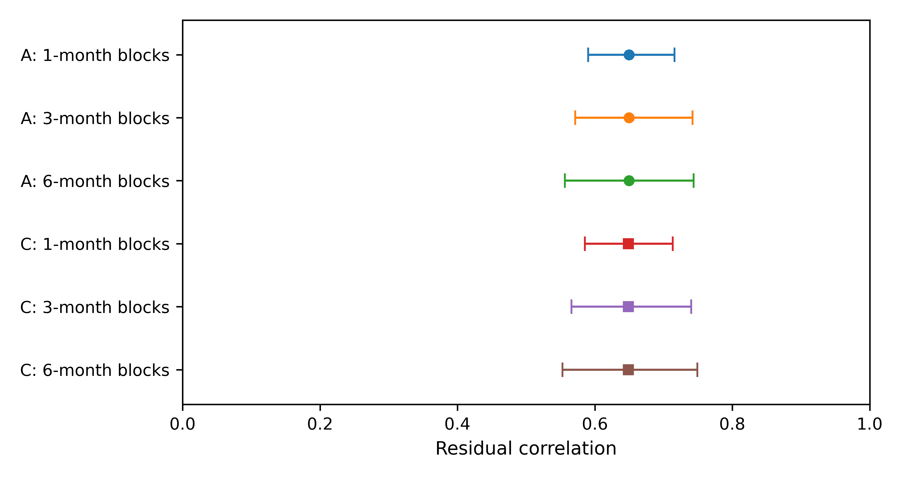
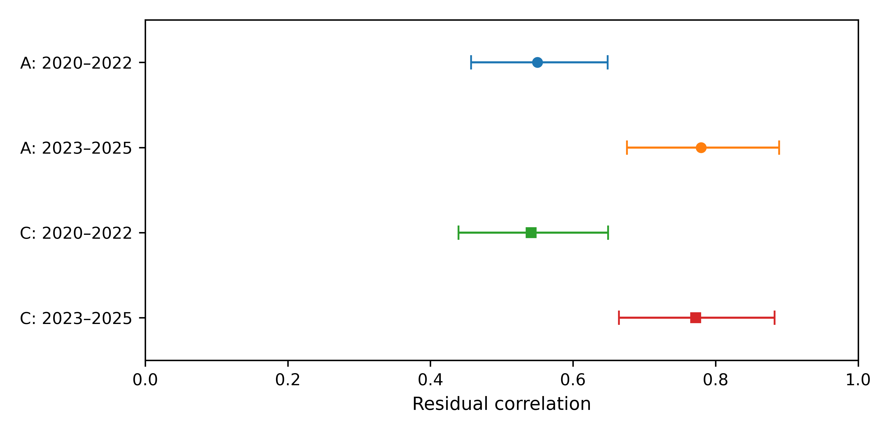

# Bid and award dispersion in European carbon auctions

*Conditional association and temporal heterogeneity, 2020–2025*

## Abstract

Auction volume and participant counts summarize market scale, but they do not determine how dispersed submitted and awarded quantities are. We examine the relationship between the two reported dispersion measures in 1,281 successful European Union Allowance auctions during 2020–2025. Each measure is the ratio of a reported standard deviation to its reported mean, without assuming matched bidder populations. After conditioning on auction volume, total and successful bidders, the cover ratio, auction series and year–month effects, the residual correlation is 0.650 under a log-one-plus transformation and 0.649 under natural logarithms. Exploratory three-month block intervals are [0.571, 0.742] and [0.566, 0.740]. The positive direction also survives the specified reduced-control and influence checks. Its strength is time-dependent: residual correlations are about 0.55 in 2020–2022 and 0.78 in 2023–2025, with separately estimated control relationships. Denominator identities clarify what is removed by normalization controls and what remains an estimated association. The findings characterize shared variation in public quantity statistics while showing that a pooled coefficient is an incomplete description of the archive. They do not establish interchangeable indicators, a causal allocation effect or a change in matched-bidder inequality. The historical design and uncertainty calculations are exploratory.

**Keywords:** European Union Allowances; primary auctions; quantity dispersion; participation; measurement; temporal heterogeneity

**JEL classification:** D44; C13; Q58

## 1 Introduction

Carbon-auction reports describe both the volume of bids and the distribution of quantities bid and won. These are distinct aspects of the primary market. The cover ratio summarizes total bids relative to the quantity offered, and participant counts summarize entry and success. Neither determines the standard deviation of quantities across the participants represented in a report. The European Commission publishes these quantity statistics together, while the European Securities and Markets Authority (ESMA) separately examines participation and concentration (European Commission 2024; ESMA 2025). Their joint interpretation raises a focused question: how much do the two reported dispersion measures co-move after accounting for auction scale and participation, and does the same relationship describe the whole reporting period?

The question concerns how to read public auction information, not how to infer an unobserved bidder distribution from an aggregate table. If the two measures contain similar conditional variation, reading them as unrelated descriptions would miss that connection. A positive correlation, however, neither makes them interchangeable nor establishes that they measure one latent concept. Likewise, an average relationship over several years may remain a useful summary even when it conceals a change in the strength of the association. Quantifying that strength and its temporal scope is therefore more informative than testing the sign alone.

A positive association is plausible because awards originate in submitted bids. It is not a consequence of total-volume accounting: the same total quantity and number of recipients can be consistent with different dispersions. Bidding and allocation may nevertheless generate a strong relationship without any causal effect identified by an aggregate regression. There is a further measurement issue. Means on the bid and award sides may refer to all participating bidders and successful bidders, respectively, while the corresponding standard-deviation populations are incompletely documented. We therefore study the reported indicators on their own terms and do not equate their association with dispersion changing within a common bidder population.

The sample comprises 1,281 successful European Union Allowance (EUA) auctions in the EU, DE and PL reporting series of the European Energy Exchange (EEX) from 2020 to 2025. The unit is one completed auction report. We relate its reported bid and award standard-deviation-to-mean ratios, conditioning on auction volume, total and successful bidders, the cover ratio, and series and year–month effects. Two transformations are evaluated on the identical sample. Reduced-control and influence checks assess specific sources of specification dependence. A comparison of the already explored periods 2020–2022 and 2023–2025 allows the conditional relationship, including the nuisance coefficients, to differ over time.

The pooled residual correlation is approximately 0.65 under both transformations. The association remains positive before adding the cover ratio and successful-bidder count, and under the specified observation, month, year and series deletion checks. Yet its strength is not uniform: correlations are approximately 0.55 in the early period and 0.78 in the late period. The period-specific slope contrasts are positive under the stated exploratory block-resampling procedure. Directional robustness and temporal constancy are thus different empirical properties; the first does not imply the second.

The paper contributes a conditional, period-specific description of two publicly reported quantity indicators. It complements price-focused EUA auction research by changing the outcome of interest, not by claiming that quantities have been ignored. It adds to the descriptive tables in official reports by quantifying their joint variation after a specified set of controls and by documenting a temporal qualification to the pooled result. Finally, the denominator analysis separates accounting identities from estimated association. It is a measurement diagnostic, not a new estimator or a demonstration that every mechanical link has been removed. These contributions concern interpretation of the reporting archive; no operational forecasting or surveillance benefit is tested.

The study is retrospective and exploratory. Historical data and earlier results were inspected before the supplementary checks were recorded, so the reported intervals do not adjust for the complete selection history. Section 2 positions the question, Section 3 defines the measures and design, Section 4 presents the evidence, and Sections 5 and 6 discuss its meaning and limits. Online Resource 1 gives source provenance and the full sensitivity record.

## 2 Auction context and related research

### 2.1 Allocation, participation and quantities

EEX describes its emissions auctions as single-round, sealed-bid, uniform-price auctions. Bids are ranked by price, successful orders pay the clearing price, and marginal execution can be partial. Participants may bid on their own account or on behalf of clients (EEX n.d.). A reporting participant therefore need not be the final installation using allowances for compliance. This distinction matters for the quantities and counts studied here, which cannot be converted into client-level demand without additional information.

Auctioning allowances can affect the distribution of rents and the allocation of permits, rather than only the observed clearing price (Cramton and Kerr 2002). Multi-unit auction theory also links bidding incentives and demand reduction to allocation outcomes (Ausubel et al. 2014). These considerations explain why quantity distributions are economically relevant. They do not turn our report-level regression into a test of strategic bidding: private valuations and participant-specific bid schedules are absent.

For this reason, the statistical question is deliberately separate from a mechanism question. We ask whether the published dispersion measures share conditional linear variation and whether its strength differs between the two historical periods. We do not test which auction rule produced the relationship, or whether a stronger relationship represents a more efficient allocation. This leaves an estimable reporting-level object without imposing behavioural restrictions that the data cannot evaluate.

### 2.2 Direct comparisons and measurement interpretation

Bosco (2023) provides a direct primary-market comparison, studying Phase III EUA auction prices and return volatility using a bidding model and GARCH specifications. Participation and the cover ratio enter that analysis; its bid spread is a price variable, not a quantity standard deviation. Niu and Liu (2024) instead forecast EUA futures volatility with macroeconomic information. Neither price variation over time nor a forecast issued before trading is the outcome examined here: our quantities and conditioning variables come from the same completed auction report.

Official reporting is an equally important comparator. The Commission distinguishes individual-auction means from monthly aggregates and describes the bid and award means using participating and successful bidders, respectively (European Commission 2024). ESMA (2025) distinguishes participation indicators from concentration statistics and identifies different data sources. Quantity dispersion is therefore an established reporting dimension. Our empirical increment is a conditional comparison of the two reported measures and its temporal scope, not the construction of another conventional ratio or a claim of first use of these fields.

Two measurement cautions shape the design. Shared ratio components can affect regression relationships, so normalizing by a mean is not a substitute for making totals and counts explicit (Kronmal 1993). In addition, association between observed indicators does not identify a latent common factor. The multiple-proxy framework of Meijer et al. (2025) makes the identification and normalization conditions for that different task explicit. We impose no such factor model. The analysis retains the original report fields, examines the specified transformations and control sets, and uses a separate algebraic check to explain the role of constructed denominators.

## 3 Data and empirical design

### 3.1 Reporting archive and sample definition

The data are six EEX annual primary-auction workbooks for 2020–2025, preserved in a fixed research snapshot. Extracting every dated row yields 1,327 records. The sample retains product code T3PA, the EU/DE/PL reporting series and an explicit successful status. The rule excludes 38 other-product records, five records outside the specified series and three cancelled auctions. It leaves 1,281 unique auctions between 7 January 2020 and 15 December 2025, covering all 72 calendar months. Table 1 gives their distribution. The three series belong to the same allowance market and are not independent-market replications.

**Table 1 Sample composition by year and reporting series**

| Year | EU | DE | PL | Total |
|---|---:|---:|---:|---:|
| 2020 | 139 | 46 | 24 | 209 |
| 2021 | 132 | 45 | 46 | 223 |
| 2022 | 142 | 46 | 23 | 211 |
| 2023 | 143 | 47 | 24 | 214 |
| 2024 | 142 | 46 | 24 | 212 |
| 2025 | 142 | 45 | 25 | 212 |
| Total | 840 | 275 | 166 | 1281 |

*Note:* Counts refer to successful T3PA auctions satisfying the stated series restriction. Cancelled auctions and other products are not recoded as zero outcomes. The first three years contain 643 auctions and the final three contain 638.

The selected sample has complete numeric fields for the fixed measures and controls. Both reported means are positive; neither standard-deviation field contains a zero. No auction is removed because its dispersion ratio is large or small. There is one selected auction per distinct date, but observations can remain dependent over time. Selection on successful completion defines the population of interest; the analysis does not describe cancelled auctions or latent demand.

Every selected record is linked to its source workbook, sheet and row. Thirteen numeric fields for all 1,327 dated records were compared with the extraction, giving 17,251 matching cell comparisons. A separate XML reading route agreed with the workbook import, and all 46 exclusions were reconciled. This audit establishes the traceability of the frozen numerical input, not a historical first-release archive. Online Resource 1 records the exact versions, fields and reproduction entry points.

### 3.2 Reported measures and linear projection

Let $\mu^b_t,s^b_t$ denote the reported mean and standard deviation of bid volume, and $\mu^w_t,s^w_t$ the corresponding reported moments of volume won. Define

$$
r^b_t=\frac{s^b_t}{\mu^b_t},\qquad r^w_t=\frac{s^w_t}{\mu^w_t}.\qquad (1)
$$

We call these *reported dispersion ratios*. The original labels refer to volume per bidder. Nevertheless, the population underlying each standard deviation and its variance divisor have not been conclusively matched to the paired mean throughout the archive. The ratios are therefore not interpreted as verified coefficients of variation for an identical population before and after allocation. This restriction affects the economic interpretation, not the arithmetic definition in (1).

Specification A sets $x_t=\log(1+r^b_t)$ and $y_t=\log(1+r^w_t)$. The main conditional projection is

$$
y_t=\beta x_t+\boldsymbol{\gamma}^{\prime}\mathbf{z}_t+\alpha_{j(t)}+\delta_{m(t)}+u_t,\qquad (2)
$$

where $j(t)$ denotes the reporting series, $m(t)$ the original year–month, and $\mathbf{z}_t=(\log R_t,\log V_t,\log N_t,\log S_t)^{\prime}$. Here $R$ is the reported cover ratio, $V$ reported auction volume, $N$ total bidders and $S$ successful bidders. All observations have equal weight. The pooled full design has rank 79 and 1,202 residual degrees of freedom.

The fixed supplementary measurement comparison contains A, a positive-standard-deviation version of A labelled B, and a natural-log version C on the same positive sample. Since all selected standard deviations are positive, A and B are identical. B is retained in the reproduction record as a sample-eligibility check rather than a separate result. C uses $x_t=\log r^b_t$ and $y_t=\log r^w_t$ on exactly the same 1,281 rows. No constant is added to a zero standard deviation.

All variables concern the same completed auction. In particular, the cover ratio and successful-bidder count are simultaneous outcomes, not instruments or inputs known before bidding. Equation (2) is an equal-auction-weighted descriptive linear projection for the selected archive. Its coefficient depends on the conditioning set and on the distribution of those auctions. To examine dependence on those conditions, we also report fixed effects alone and fixed effects plus $\log V$ and $\log N$. These models answer related, but not identical, conditional questions. Year–month effects account for monthly levels; they do not absorb every daily common shock.

Reported means are numerically consistent with total submitted volume divided by $N$ and reported auction volume divided by $S$, to the archive's displayed precision. This creates an explicit denominator structure. Under natural logs, constructed means and a constructed cover ratio yield additive identities that disappear after projection on the corresponding totals and counts. The log-one-plus transformation does not have that property. Online Resource 1 derives and checks these identities, keeping constructed fields separate from the reported fields used in (2).

### 3.3 Magnitude, dependence and sensitivity

Let $\mathbf Z$ contain the nuisance regressors and fixed effects in (2), and let $M_Z$ denote the residual-maker for that space. With $\widetilde{\mathbf x}=M_Z\mathbf x$ and $\widetilde{\mathbf y}=M_Z\mathbf y$, the coefficient and standardized association are

$$
\widehat\beta=\frac{\widetilde{\mathbf x}^{\prime}\widetilde{\mathbf y}}{\widetilde{\mathbf x}^{\prime}\widetilde{\mathbf x}},\qquad
\widehat\theta=\widehat\beta\frac{s(\widetilde{\mathbf x})}{s(\widetilde{\mathbf y})}.\qquad (3)
$$

This is the partial-regression representation (Lovell 1963). In the present equal-weight, single-added-regressor setting, $\widehat\theta$ is the sample correlation of the two residuals. The partial coefficient of determination satisfies

$$
R^2_{\mathrm{partial}}=\frac{\operatorname{SSE}_Z-\operatorname{SSE}_{Z,x}}{\operatorname{SSE}_Z}=\widehat\theta^{\,2}.\qquad (4)
$$

These are complementary scales for the same association, not independent pieces of evidence. The residual correlation is symmetric in the two indicators; placing award dispersion on the left of the regression does not establish a direction of transmission. Pooled and subperiod correlations use their respective fitted control spaces and variances, so a change in correlation need not be a change in a structural parameter. We also report the fitted transformed-response contrast corresponding to an observed interquartile range of residualized $x$. It is a scale illustration along the fitted partial regression, not an intervention or an expected procurement gain.

The principal uncertainty calculation uses a month-block resampling design for dependent observations, within the general class discussed by Lahiri (2003). It resamples non-circular blocks of three consecutive calendar months. Starting months are drawn with replacement; blocks are concatenated and truncated to a 72-month axis. All auctions in a selected month are retained jointly. Repeated months increase row multiplicities and retain their original fixed-effect labels. The entire conditional projection is re-estimated for each of 999 draws. A and C share the draw indices. One- and six-month blocks, with 199 draws each, provide bounded sensitivity checks. Intervals are percentile intervals with linear quantile interpolation.

We examine influence by deleting each observation, month, year and series, and by jointly omitting the 13 largest-Cook-distance observations under each specification (Cook 1977). These diagnostics do not redefine the main sample. Within-series models retain their own monthly effects; empty months retain their positions on the 72-month resampling axis. Reduced-control and within-series intervals use 499 and 399 three-month block draws, respectively.

### 3.4 Historical comparison and research process

The historical comparison divides 2020–2022 from 2023–2025, a split already present in earlier exploration. The two samples contain 643 and 638 observations, and all nuisance coefficients are estimated separately. Each 36-month half is independently resampled in three-month blocks for 999 paired draws, with common indices across transformations. The primary contrasts are late-minus-early slopes. Each transformation receives a 97.5% percentile interval as a Bonferroni-style nominal family-95% sensitivity calculation. This interpretation is conditional on adequate individual interval approximations; it is not a new guarantee of coverage for the post-exploration analysis.

The full archive and earlier results were inspected before the supplementary protocols were recorded. The evidence for the first protocol freeze is partial. This study is consequently retrospective and exploratory, with no untouched holdout or preregistration claim. The block intervals do not adjust for the full history of specification selection. They also do not guarantee coverage under arbitrary temporal change: pooled slope heterogeneity complicates a stationarity interpretation, while independent half-period resampling does not represent all cross-boundary dependence. These qualifications apply to all inferential results below.

Generative AI tools, including ChatGPT, assisted research organization, code-related work, and manuscript drafting and revision. Their role included generative drafting rather than spelling and grammar correction alone. This manuscript revision reads frozen numerical outputs and introduces no new statistical estimation. The accompanying protocols, source checks and code specify the analysis independently of the drafting tools.

## 4 Results

### 4.1 Magnitude of the pooled relationship

Table 2 reports the two distinct transformations. Under A, the slope is 0.8802 and the residual correlation is 0.6496, with a three-month block interval of [0.5714, 0.7422]. Under C, the corresponding values are 0.8797 and 0.6486, with correlation interval [0.5660, 0.7402]. Thus, the relationship is of similar standardized magnitude under the two transformations on the identical sample. Its persistence is not an artefact of dropping zero-standard-deviation observations, because none are present.

**Table 2 Pooled conditional association**

| Transformation | $\widehat\beta$ | 95% interval for $\beta$ | $\widehat\theta$ | 95% interval for $\theta$ |
|---|---:|---|---:|---|
| A: log-one-plus | 0.8802 | [0.7506, 1.0384] | 0.6496 | [0.5714, 0.7422] |
| C: natural log | 0.8797 | [0.7627, 1.0143] | 0.6486 | [0.5660, 0.7402] |

*Note:* Each row uses 1,281 successful auctions, the full controls and reporting-series and year–month effects. Intervals use 999 three-month block draws. The planned positive-sample log-one-plus specification B equals A and is not duplicated. The intervals are exploratory, as described in Section 3.4.

The partial $R^2$ is approximately 0.422 under A and 0.421 under C. These values describe the in-sample reduction in residual squared error relative to the fitted control-only model, not validation of one indicator as a substitute for the other. They do not describe a proportion of total market variation explained or an out-of-sample improvement. To illustrate the association on its transformed scale, the frozen estimates imply fitted contrasts of 0.0816 under A and 0.1408 under C across their respective observed interquartile ranges of residualized bid dispersion. Different transformations have different units, so equality of those contrasts is neither expected nor required.

Figure 1 displays the main interval together with the two block-length checks. The direction remains positive throughout these specified resampling choices. Both principal slope intervals in Table 2 include one. More importantly, the slope is a relationship across auction reports, not a comparison of an identical bidder distribution before and after allocation. Its value relative to one is not a test of dispersion compression.

{width=6.4in}

**Fig. 1** Residual association under alternative month-block lengths; circles denote log-one-plus ratios and squares natural-log ratios. Bars are exploratory 95% percentile intervals; three-month blocks use 999 draws, while one- and six-month checks use 199. The three-month rows reproduce Table 2

### 4.2 Directional persistence and temporal heterogeneity

A positive pooled relationship need not have a constant strength. Table 3 and Fig. 2 compare the two historical halves. For A, the residual correlation is 0.5501 in 2020–2022 and 0.7798 in 2023–2025. For C, it is 0.5414 and 0.7719. Both halves retain positive association, but the conditional relationship is stronger in the latter period.

**Table 3 Historical period comparison**

*Panel A: Period-specific estimates*

| Spec. | Period | $n$ | $\widehat\beta$ | $\widehat\theta$ [95% interval] |
|---|---|---:|---:|---|
| A | 2020–2022 | 643 | 0.6728 | 0.5501 [0.4570, 0.6486] |
| A | 2023–2025 | 638 | 1.1825 | 0.7798 [0.6757, 0.8892] |
| C | 2020–2022 | 643 | 0.6880 | 0.5414 [0.4394, 0.6493] |
| C | 2023–2025 | 638 | 1.1232 | 0.7719 [0.6645, 0.8829] |

*Panel B: Late-minus-early slope differences*

| Transformation | $\Delta\widehat\beta$ | 97.5% interval |
|---|---:|---|
| A | 0.5097 | [0.3340, 0.7222] |
| C | 0.4353 | [0.2605, 0.6344] |

*Note:* Nuisance coefficients are estimated separately in each half. The intervals use 999 paired draws from independent three-month resampling within each 36-month half. Panel A reports 95% intervals for residual correlations; Panel B reports 97.5% intervals for each transformed slope contrast. The historical split and inference limitations are described in Section 3.4.

The late-minus-early slope difference is 0.5097 under A and 0.4353 under C. Their 97.5% block intervals are [0.3340, 0.7222] and [0.2605, 0.6344]. Under this specific exploratory comparison, the differences are not close to zero. They support a period-dependent description under the stated approximation. The pooled coefficient remains a full-sample summary; it should not be read as a parameter shown to be constant in every period. January 2023 is the boundary of a previously explored historical comparison, not an established exogenous intervention date.

{width=6.4in}

**Fig. 2** Residual association by historical period; circles denote log-one-plus ratios and squares natural-log ratios. Bars give exploratory 95% intervals from 999 three-month block draws within each half. Slope-difference intervals are reported separately at the 97.5% level in Table 3

The distinction is economically relevant to interpretation rather than evidence of a welfare change. A higher association means that the two reported measures have a closer conditional linear relationship in that period. It does not, by itself, mean that the auction distributes quantities more equally or less competitively. Changes in participation, order composition, reporting or shared conditions could be consistent with the result; these regressions do not select among those explanations.

### 4.3 Controls, influence and reporting series

Table 4 examines whether the positive direction appears only after conditioning on the cover ratio and successful-bidder count. With series and year–month effects alone, residual correlations are 0.6243 under A and 0.6197 under C. Adding volume and total participation yields 0.6289 and 0.6239. The full controls give slightly larger values. Thus, the direction is already present in models that omit the two additional simultaneous outcomes. This does not establish their exogeneity or eliminate selection associated with successful auctions.

**Table 4 Residual association across conditioning sets**

| Conditioning set | A: $\widehat\theta$ [95% interval] | C: $\widehat\theta$ [95% interval] |
|---|---|---|
| Series and year–month effects | 0.6243 [0.5596, 0.7067] | 0.6197 [0.5494, 0.7017] |
| Effects + volume + total bidders | 0.6289 [0.5626, 0.7094] | 0.6239 [0.5521, 0.7044] |
| Full controls | 0.6496 [0.5714, 0.7422] | 0.6486 [0.5660, 0.7402] |

*Note:* Reduced-control intervals use 499 three-month block draws. The full-control row reuses the 999-draw principal intervals. Each conditioning set defines a different descriptive projection; these are not instruments or randomized comparisons.

Deletion diagnostics lead to the same directional conclusion. Removing one month at a time gives residual correlations of 0.6419–0.6656 under A and 0.6405–0.6674 under C. Year and series deletions produce wider positive ranges. Individual-observation deletion also preserves the direction. Omitting the 13 largest-Cook-distance observations raises the correlations to 0.6911 and 0.6930; these values are diagnostic only, and all principal estimates retain the full sample. Online Resource 1, Table S3, reports the complete ranges. A statistically influential auction is not thereby an erroneous observation.

Within-series estimates are positive in EU, DE and PL under both transformations (Online Resource 1, Table S4). Their differences are not formal between-series contrasts or independent-market replications. In particular, PL has 166 observations and only 90 residual degrees of freedom after its controls and month effects. Taken together, the control and influence checks show that a small or uniquely selected part of the archive does not sustain the pooled direction within the diagnostics conducted. They do not rule out all common determinants of the two report fields.

## 5 Discussion

### 5.1 Shared variation is not interchangeable information

The main empirical result is a sizeable conditional association, not a one-to-one mapping. Auction scale, participant counts and the fixed effects leave substantial shared linear variation in the two reported dispersion indicators. That finding is visible under the ordinary-log specification as well as the original log-one-plus specification, and with reduced conditioning sets. It is consequently more informative than a positive unconditional correlation, but it does not identify an additional behavioural channel.

The distinction matters when interpreting public auction tables. Coverage and participation describe aggregate bids and entry; they do not uniquely determine quantity dispersion. Our estimates quantify one relationship among these reporting dimensions. A residual correlation near 0.65 nevertheless falls short of identity, and neither the regression nor its partial coefficient of determination establishes that one indicator can replace the other. The natural-log denominator identity also does not establish substitution: it describes a change of representation within a fixed control space, not information sufficient to recover an unobserved allocation distribution.

This reading is consistent with keeping participation, quantity moments and concentration conceptually distinct. The paper supplies a conditional benchmark for the historical reporting fields, not a new competition test or a prescribed monitoring rule. Any benefit from using the relationship in a forecasting, surveillance or procurement decision would require a separate evaluation.

### 5.2 Temporal heterogeneity qualifies, rather than nullifies, the pooled estimate

The period comparison provides an important qualification to that benchmark. Conditional correlations are higher in 2023–2025 than in 2020–2022, and the slopes differ when nuisance coefficients are estimated separately. The pooled estimate is therefore an incomplete description of the two historical halves. This does not make a pooled descriptive projection invalid; it explains why the period-specific estimates should accompany it.

Neither the late-period slope above one nor the stronger correlation indicates a welfare improvement, greater concentration or a causal amplification of dispersion. The projections may change with bidding composition, the distribution of covariates, reporting conventions or common market conditions. The present archive does not distinguish those explanations. Consistent labels across workbooks support structural continuity of the fields, but do not establish unchanged statistical populations. Resolving that metadata would be particularly useful before interpreting the temporal difference as a change in behaviour.

### 5.3 Scope of the evidence

Three limits define what can be learned. First, the outcomes are report fields. Standard-deviation populations and variance divisors have not been conclusively matched to their paired means for the entire archive. This leaves the numerical ratios well defined, while preventing their use as authenticated same-population coefficients of variation or matched-bidder inequality changes. A bidder may also represent clients whose separate quantities are not observed.

Second, success is a sample condition and the response and controls are joint auction outcomes. The reduced-control comparison shows that the positive direction does not appear only after conditioning on successful-bidder counts and coverage. It does not remove selection, shared determinants or possible collider effects. Neither coefficients nor residual correlations are causal effects, and the statement of a conditional relationship should not be interpreted as adjustment sufficient for a mechanism claim.

Third, uncertainty statements are approximate and exploratory. Month blocks preserve selected forms of dependence, not arbitrary structural change; the independent half-period procedure does not represent all dependence across the boundary. The historical data and prior results were already inspected, and the incomplete first-freeze record does not support a preregistration claim. The numerical cross-checks and sensitivities constrain particular implementation and specification concerns, but do not supply selection-adjusted inference. These qualifications are part of the result rather than reasons to replace it with a more favourable specification.

## 6 Conclusion

Public EUA auction reports contain a positive relationship between reported bid and award dispersion beyond the specified auction-scale, participation and calendar controls. In 1,281 successful auctions during 2020–2025, the residual correlation is approximately 0.65 under two transformations. Its direction survives the completed control, block-length and influence checks, while its magnitude differs between the already explored historical halves.

The empirical contribution is a measurement-explicit and period-specific description of this joint variation. Accounting identities do not determine its estimated magnitude, and a pooled relationship does not fully describe its temporal scope. The findings support reading the two quantity indicators together with their definitions and time span made explicit. They neither identify allocation effects nor validate the indicators as substitutes for bidder-level information or as tools for operational decisions.

## Data and code availability

The EEX workbooks, extraction and provenance records used for this version are identified by commit `5745eb3ddca79602346053446583d794b0e09800` in the repository `124-creator/-123`. The principal analysis and robustness extension are fixed at commits `e25c1e02e1a58e0aec1084f7419066855e9565ec` and `d4b26f1bbd8c1d7c036259e48e119c9c12f6c9a9`, respectively. Online Resource 1 gives the exact paths and reproduction requirements. Data originate from EEX and remain subject to the provider's rights and applicable terms; repository availability does not create a separate redistribution licence. The authors must confirm the permissible final data-deposit or access arrangement before submission. The manuscript revision changes presentation, not the frozen estimates.

## Statements and declarations

**Author-completion notice:** This review version must not be submitted with this notice in place. Authorship, affiliations, corresponding-author details, acknowledgments, funding, competing interests and contributions require confirmation in the separate author-information file. No absence of funding or competing interests is inferred. The generative-AI disclosure in Section 3.4 must be checked against the project record before author approval.

## Supplementary information

**Online Resource 1** Field dictionary, sample provenance, resampling implementation, additional sensitivity tables and measurement identities

## References

Ausubel LM, Cramton P, Pycia M, Rostek M, Weretka M (2014) Demand reduction and inefficiency in multi-unit auctions. The Review of Economic Studies 81:1366–1400. https://doi.org/10.1093/restud/rdu023

Bosco B (2023) Trade, equilibrium prices and rents in European auctions for emission allowances. Environmental Economics and Policy Studies 25:87–113. https://doi.org/10.1007/s10018-022-00344-y

Cook RD (1977) Detection of influential observation in linear regression. Technometrics 19:15–18. https://doi.org/10.1080/00401706.1977.10489493

Cramton P, Kerr S (2002) Tradeable carbon permit auctions: how and why to auction not grandfather. Energy Policy 30:333–345. https://doi.org/10.1016/S0301-4215(01)00100-8

EEX (n.d.) Frequently Asked Questions: Emissions Auctions. European Energy Exchange. https://www.eex.com/en/faq. Accessed 10 October 2026

European Commission (2024) Auctions by the Common Auction Platform: April, May, June 2024. https://climate.ec.europa.eu/document/download/d962459c-021e-4901-b49f-e5d37e5d2c93_en?filename=cap_report_202406_en.pdf. Access record: 10 October 2026

European Securities and Markets Authority (ESMA) (2025) Market Report on EU carbon markets. ESMA50-481369926-30552. https://www.esma.europa.eu/sites/default/files/2025-10/ESMA50-481369926-30552_Carbon_Markets_Report_2025.pdf. Accessed 10 October 2026

Kronmal RA (1993) Spurious correlation and the fallacy of the ratio standard revisited. Journal of the Royal Statistical Society: Series A 156:379–392. https://doi.org/10.2307/2983064

Lahiri SN (2003) Resampling methods for dependent data. Springer, New York. https://doi.org/10.1007/978-1-4757-3803-2

Lovell MC (1963) Seasonal adjustment of economic time series and multiple regression analysis. Journal of the American Statistical Association 58:993–1010. https://doi.org/10.1080/01621459.1963.10480682

Meijer E, Postepska A, Wansbeek T (2025) Handling multiple proxies. Empirical Economics 69:2901–2926. https://doi.org/10.1007/s00181-025-02825-x

Niu H, Liu T (2024) Forecasting the volatility of European Union allowance futures with macroeconomic variables using the GJR-GARCH-MIDAS model. Empirical Economics 67:75–96. https://doi.org/10.1007/s00181-023-02551-2
